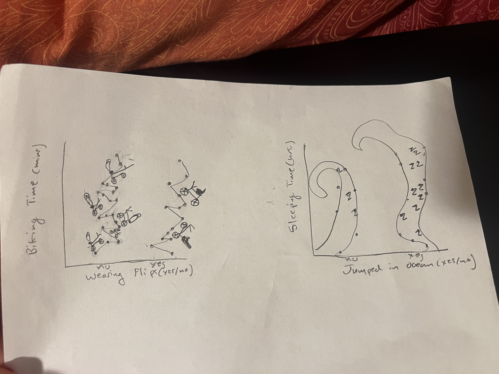
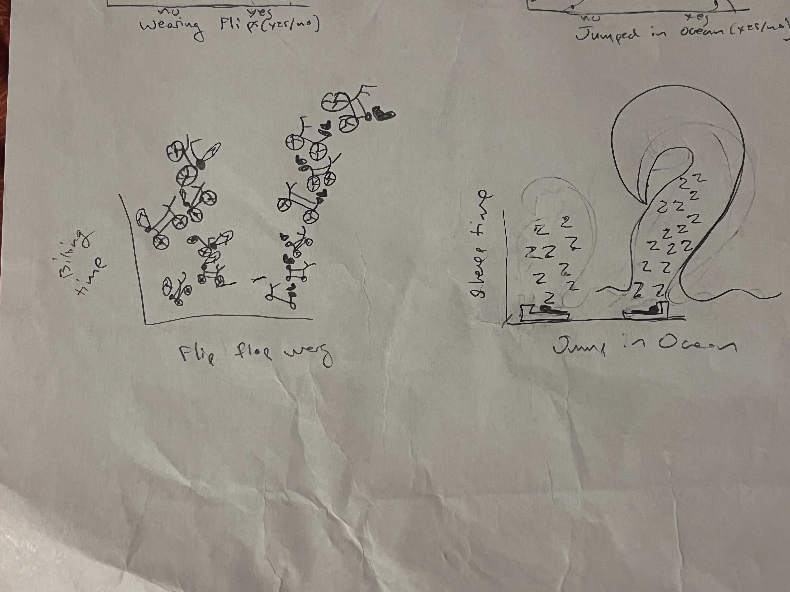
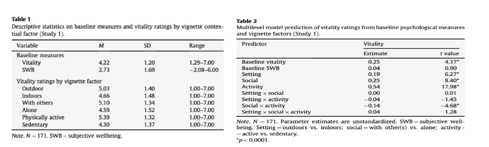

# Set Up

```{r}
#| label: reading in packages
#| message: false
library(tidyverse)#general use for data wrangling, cleaning, etc.
library(janitor)
library(calecopal)
library(readr)
salinity<- read_csv("data/salinity-pickleweed (1).csv")
my_data_autrin_2 <- read_csv("data/my_data - autrin 2.csv")
my_data_2_autrin <- read_csv("data/my data 2 - autrin.csv")
```

# Problem 1

a\. The two appropriate tests are the Pearson's correlation and the Spearman rank correlation. Pearson's is a parametric test that would assume that the salinity and California pickleweed biomass are both continuous variables with a normally distributed relationship measuring the strength of linearity. The Spearman is a non-parametric test that would measure the monotonic relationship between these two variables using ranks.

b\.

```{r}
#| label: Salinity vs biomass visualization
#| message: false
ggplot(data = salinity, #data set to plot
       aes(x = salinity_mS_cm, #set x-axis
           y = pickleweed, #set y-axis
           color = salinity_mS_cm)) +
  geom_point(color = "tan3") + #create scatterplot and channeg color of points
  theme_minimal() + #Put background as white
  labs(x = "Soil Salinity(mS/cm)", #name x-axis
       y = "Pickleweed Biomass(g)", #name y-axis
       title = "As Salinity Increases Biomass Increases") + #Make title
  theme(legend.position = "none") #remove legend
```

c\.

```{r}
#| label: Linear model function
#| message: false
pickleweed_model <- lm( #creating model object and creating linear model function
  pickleweed ~ salinity_mS_cm, #formula
  data = salinity #pulling data from "salinity"
)
```

```{r}
#| label: base R residuals
#| message: false
par(mfrow = c(1,2)) #display plots ina a 1x2 grid
plot(pickleweed_model) #plotting model data
```

The residual graphs show that the data has homoscedasicity and a clear normal distribution between the two variables . This means the Pearson's correlation test will be the most effective.

```{r}
#| label: Running a Pearson's correlation test
#| message: false
cor.test(salinity$salinity_mS_cm,salinity$pickleweed, # doing a coorelation test pulling from salinity data set
         method = "pearson") # using Pearson's coorelation test
```

I checked fro normality and homoscedasticity in the qq plot and residual vs fitted plots. This would prove a normal distribution of the variables to justify using the Pearson's correlation test

d\.

For these variables we used the Pearson's coorelation test because both variables were continious and showed normal distirbution. We found a moderate relationship between soil salinity(mS/cm) and pickleweed biomass(g)(Pearson's r = 0.53, t(21) = 2.9, p = 0.01, ⍺ = 0.5). This shows that the correlation between salinity and biomass is significant which indicated that higher salinity soils relate to pickleweeds with larger biomass.

e\.

Larger, heavier pickleweeds have a clear positive relationship with soil salinity. This means to have the greatest success in repopulating the pickleweeds we should plant them in places with higher salinity.

f\.

```{r}
#| label: Running a Spearman rank correlation test
#| message: false
cor.test(salinity$salinity_mS_cm,salinity$pickleweed, # doing a coorelation test pulling from salinity data set
         method = "spearman") #using the spearman rank coorelation
```

By doing the alternative test( The Spearman rank correlation) the results would be very similar and would both reject the null hypothesis that the two variables have no relation to each other. We found a moderate relationship between soil salinity(mS/cm) and pickleweed biomass(g)(Spearman's r = 0.59, t = 824, p = 0.003, ⍺ = 0.5).

# Problem 2

a\.

```{r}
Flipflop_data <- my_data_autrin_2 #Changing data set name
Flipflop_data <- Flipflop_data[-1,] |> #removing N/A column from data set
clean_names() |> #cleaning names to all lowercase _
select(wearing_flips,biking_time_mins) #selecting response/predictor variables

ggplot(data = Flipflop_data, #pulling from this data set
       aes(x = wearing_flips, #x-axis
           y = biking_time_mins, #y-axis
           color = wearing_flips)) + #colored points
  geom_jitter( #plot jittered points
    width = 0.10,
    size = 0.9,
    alpha = 0.8) +
  scale_color_manual(values = c("No" = "darkgreen", #changing point fill colors from default
                                "Yes" = "brown")) +
  labs(
    x = "Wearing Flip Flops(yes/no)", #name x-axis
    y = "Biking Time(mins.)", #name y-axis
    title = "Flip Flops Affect on Biking", #set title
    subtitle = "03/05/2026") + #add subtitle
  theme_classic() + #change background to white
  theme(legend.position = "none") #remove legend
```

Biking time(in mins.) calculated based on individual instances of wearing flip flops(n=30). Green points indicate non wearing flip flop times and red points indicate wearing flip flop times. The most recent calculated time was on 03/05/2026

```{r}
Sleep_data <- my_data_2_autrin #Changing data set name
Sleep_data <- Sleep_data[-1,] |> #removing N/A column from data set
clean_names() |> #cleaning names to all lowercase _
select(jumped_in_ocean_yes_no, hours_of_sleep_hrs) #selecting response/predictor variables

ggplot(data = Sleep_data, #pulling from this data set
       aes(x = jumped_in_ocean_yes_no, #x-axis
           y = hours_of_sleep_hrs, #y-axis
           color = jumped_in_ocean_yes_no)) + #colored points
  geom_jitter( #plotting jittered points
    width = 0.10,
    size = 0.9,
    alpha = 0.8) +
  scale_color_manual(values = c("No" = "red", #changing point fill colors from default
                                "Yes" = "blue")) +
  labs(
    x = "Jumped in Ocean(yes/no)", #name x-axis
    y = "Sleeping Time(Hrs.)", #name y-axis
    title = "Ocean Dipping Affecting Sleep?", #add title
    subtitle = "03/02/2026") + #add subtitle
  theme_classic() + #background to white
  theme(legend.position = "none") #remove legend
```

Sleeping time related to jumping in the ocean. Red points show days not jumped in the ocean and blue points show days jumped in the ocean(n=30).

# Problem 3

a\.

For my biking data, I am thinking of connecting my scatter plot to make a bath and have my no side be flip-flops riding bikes and my yes side be shoes riding bikes . For the sleeping data, I'm thinking of connecting the points to make waves and change all the points inside into z's. The idea would be to include my main variables with the points on the graph.

b\.

{width="330"}

c\.

{width="340"}

d\.

For my final ideas I changed my two graphs. For the biking one, I made each point a bike wheel and made it so the wheels got bigger the higher they went(indicating more time), I still had flip flops riding the "yes" bikes and shoes riding the "no" bikes. For the sleeping one, I put a bed under the points and made all the points into Z's, and on the yes side i drew the bed and z's inside a wave. This was a sketch that was sparked by my original idea. I wanted a cartoon sort of idea that involved both variables.

e\.

Click "[view](Presentation3.pptx)" to see slides

# Problem 4

a\.

The article is focusing on the relationship between vitality and spending time outdoors and around natural environments. The question in a bundle is: does being outdoors increase vitality? A t-test wqas used for study 1. The response variable was: vitality level (on a scale from 1-7). The predictor vairiable was: vignettes(imaginary setting). The t-test was used to compare three different aspects of the vignette scenarios: vitality of outdoors vs indoors, vitality of being alone or with people, and vitality of of being active or not active. The t-test, for example for outdoors vs indoors, would show a p-value of (p\<0.0001) which demonstrates that it is not by chance that being outdoors increases vitality.


